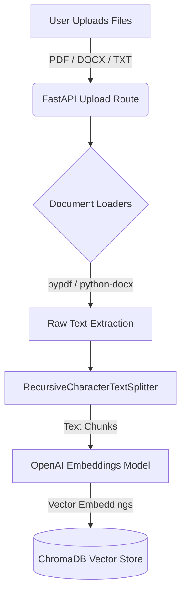
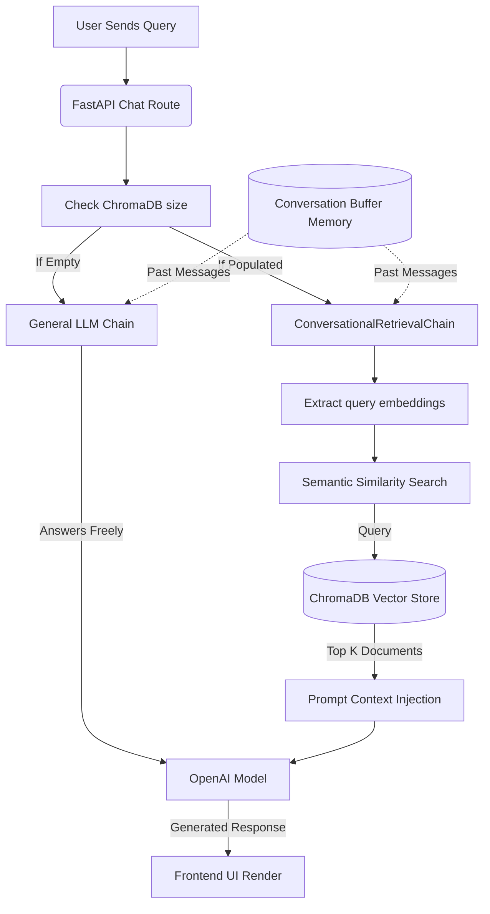

# Conversational RAG Chatbot

A production-ready full-stack Retrieval-Augmented Generation (RAG) chatbot allowing users to upload documents (PDF, DOCX, TXT) and ask contextual questions.

## Architecture

- **Frontend**: React + Vite, Tailwind CSS, Framer Motion
- **Backend**: FastAPI, LangChain, ChromaDB, OpenAI
- **Deployment**: Docker Compose ready. Frontend can be deployed to Vercel, Backend to Render/Railway.

## Data Flow Architecture

### 1. Document Ingestion Pipeline
This flow occurs when a user drops files into the application sidebar.


### 2. Retrieval & Chat Pipeline
This flow handles user queries by injecting semantic context into the language model.


## Setup Instructions

### 1. Environment Variables
Create a `.env` file in the `backend/` directory:
```env
OPENAI_API_KEY=your_sk_key_here
FRONTEND_URL=http://localhost:5173
MODEL_NAME=gpt-4o-mini
EMBEDDING_MODEL=text-embedding-3-small
```

### 2. Manual Run

**Backend:**
```bash
cd backend
python -m venv venv
source venv/bin/activate  # or venv\Scripts\activate on Windows
pip install -r requirements.txt
uvicorn app.main:app --reload
```

**Frontend:**
```bash
cd frontend
npm install
npm run dev
```

### 3. Docker Compose Run
Ensure Docker is installed and running.
```bash
docker-compose up --build
```
Access the application at `http://localhost:5173`.

## Features
- **File Upload System**: Sidebar UI to upload files using `FastAPI` file endpoints. 
- **RAG Pipeline**: Leverages `RecursiveCharacterTextSplitter` and `ChromaDB` for embedding and retrieval.
- **Conversational Memory**: Multiturn chat memory tracked via local session ID.
- **Contextual Responses**: AI restricted to grounding via System Prompts.
- **Modern UI**: Clean SaaS-like interface built with Tailwind and Framer Motion.

## API Documentation
- `POST /api/upload`: Expects `multipart/form-data` with `files`.
- `POST /api/chat`: Expects JSON `{"message": "string", "session_id": "string"}`. Returns `ChatResponse`.
- `GET /api/system/`: Health check
- `DELETE /api/system/reset`: Clears Chroma DB and Uploads.

## Deployment Guide
- **Vercel**: Link the GitHub repository and set the root directory to `frontend`. Ensure `VITE_API_BASE_URL` points to the production backend URL.
- **Render / Railway**: Link the GitHub repository and set the Dockerfile path to `backend/Dockerfile`. Add the necessary environment variables (`OPENAI_API_KEY`, etc.).
