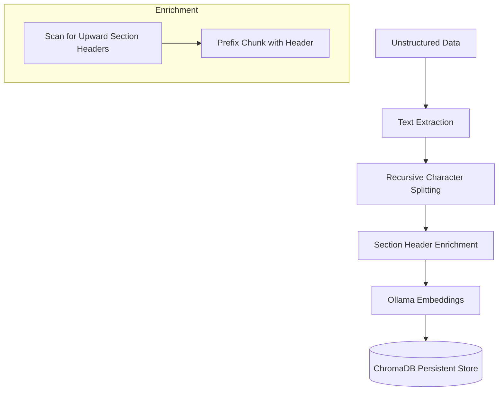
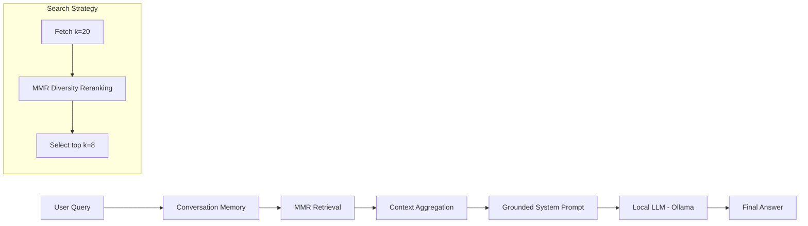

# Local RAG Assistant: Advanced Retrieval-Augmented Generation Pipeline

A high-performance, privacy-focused RAG system leveraging local LLMs for domain-specific document intelligence. This project implements advanced retrieval strategies (MMR) and context-enrichment techniques to ensure high-fidelity grounding and minimize hallucinations.

## 🏗️ System Architecture

The pipeline is split into two primary phases: **Context-Aware Ingestion** and **High-Precision Querying**.

### 1. Ingestion Pipeline
Processes raw unstructured data (PDF, DOCX, TXT) into a persistent vector database with structural context preservation.



### 2. Query & Inference Pipeline
Handles user interactions using an optimized search-and-generate loop.



---

## 🚀 Advanced ML Features

### 🧩 Context-Aware Chunking (Header Enrichment)
Traditional chunking often loses the hierarchical context of a document. This system implements **Nearest Header Enrichment**:
- **Algorithm**: During ingestion, for each chunk, the system scans backwards for lines matching heading patterns (e.g., ALL-CAPS or colon-terminated).
- **Benefit**: Chunks are prefixed with their relevant section (e.g., `[Section: Transaction States] ...`), significantly improving retrieval accuracy for questions requiring specific structural context.

### 🔍 Optimized Retrieval (MMR)
We utilize **Maximal Marginal Relevance (MMR)** to balance semantic relevance with information diversity.
- **Parameters**: `k=8`, `fetch_k=20`, `lambda_mult=0.7`.
- **Why**: Pure semantic search often returns redundant chunks. MMR ensures the retrieved context covers different aspects of the query, leading to more comprehensive answers.

### 🛡️ Grounded Generation
The system utilizes a **strictly grounded prompt** that instructs the LLM to answer *only* using provided context. 
- **Hallucination Guard**: Explicit "I safely don't know" fallback logic.
- **Local Native**: Powered by `llama3.1` (8B) or `tinyllama` (1B) via Ollama, ensuring data never leaves the local environment.

---

## 📊 Evaluation Framework (Ragas)

Performance is validated using the **Ragas** framework, which employs an LLM-as-a-judge approach to assess internal RAG metrics.

| Metric | Description | Objective |
| :--- | :--- | :--- |
| **Faithfulness** | Measures how well the answer is derived solely from context. | Minimize Hallucinations |
| **Answer Relevancy** | Measures the pertinence of the answer to the user query. | Ensure User Satisfaction |
| **Context Precision** | Measures if the ground-truth relevant chunks are ranked higher. | Optimize Vector Search |
| **Context Recall** | Measures if all necessary info to answer is present in retrieved docs. | Minimize Information Loss |

> [!NOTE]
> Evaluation is performed using `llama3.1:8b` as the critic to ensure high-quality labels.

---

## 🛠️ Technical Stack

- **Backend**: [FastAPI](https://fastapi.tiangolo.com/) - High-performance asynchronous API layer.
- **Orchestration**: [LangChain](https://www.langchain.com/) - RAG logic and chain management.
- **Vector Database**: [ChromaDB](https://www.trychroma.com/) - Persistent local vector storage.
- **Embeddings & Inference**: [Ollama](https://ollama.ai/) - Local model hosting via GGUF format.
- **Evaluation**: [Ragas](https://docs.ragas.io/) - Automated ML evaluation metrics.

---

## ⚙️ Setup & Execution

### 1. Environment Configuration
Define your model parameters and local endpoints in `backend/.env`:
```env
MODEL_NAME=tinyllama:1.1b
EMBEDDING_MODEL=mxbai-embed-large
OLLAMA_BASE_URL=http://localhost:11434
CHUNKING_SIZE=500
CHUNKING_OVERLAP=50
```

### 2. Deployment
Execute the containerized stack:
```bash
docker-compose up -d --build
```

### 3. Model Evaluation
To reproduce evaluation metrics:
```bash
python backend/evaluate_rag.py
```
Detailed metrics will be exported to `rag_evaluation_results.csv`.